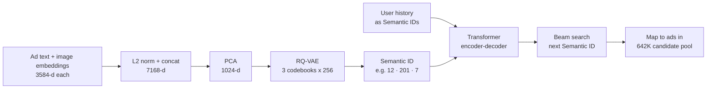
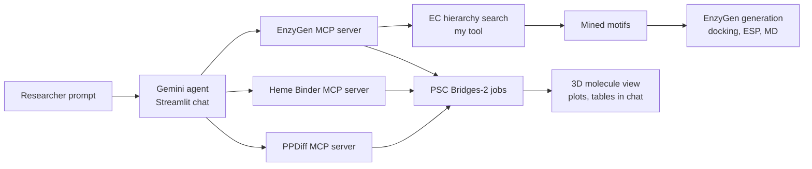
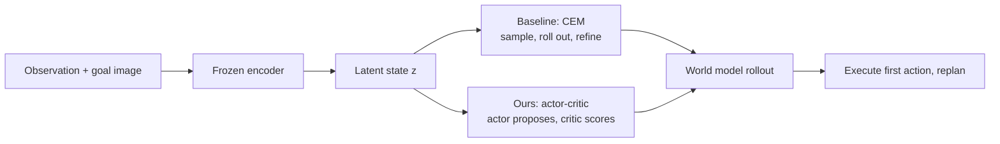

# Current Projects: Portfolio Packet

Hand this to the portfolio agent together with `public/projects/`. It adds four projects: TIGER generative retrieval, MoleculeAgent, the NaturalBench diffusion-features project, and the latent world model planning project. Same rules as the other two briefs (`HEATMAP_CASE_STUDY_BRIEF.md`, `RESEARCH_AND_EXPERIENCE_BRIEF.md`).

Sources: the local project folders (code, plans, logs, git history), the MMML proposal PDF and pipeline diagram, and the resume for TIGER's results.

---

## PART A. Instructions for the portfolio agent

### A1. Where these go

- **TIGER** gets a full project page and a homepage card.
- **MoleculeAgent** gets a full project page and a homepage card, labeled **In progress · team project**.
- **NaturalBench diffusion features** and **latent world model planning** go in a new homepage strip called **Currently working on**. Each is a small card that opens a short page. They have **no results**, so the page must never show a metrics block for them.

### A2. Homepage order (replaces the order in the other briefs)

1. HeatMap
2. TIGER generative retrieval
3. MoleculeAgent
4. Multi-modal biometric authentication
5. Secure Federated Learning for IIoT
6. Findify lost-and-found patent

Then the "Currently working on" strip (NaturalBench diffusion, latent world model planning), then Experience, then a link to the Research & Patents page.

### A3. Rules for these four

1. **Status chips** are exactly as given: `Completed`, `In progress`, or `Proposal stage`.
2. **Team projects** show a small "Team project" chip and a "My part" block. Never write copy implying Yeshwanth built the whole thing.
3. **No images exist** for TIGER, MoleculeAgent, or the world-model project. Do not use stock images. Use the diagrams, charts and components specified in each brief, built in HTML/CSS/SVG or Mermaid, matching the site's dark-minimal style.
4. Charts are built from the data rows given here, not screenshots. Show exact values on hover or as labels.
5. Anything marked `[TODO Yeshwanth]` is left off the page until he fills it in.
6. No colons or em-dashes in visible page copy.

---

## PART B. Project briefs

## Project: TIGER, Generative Retrieval for Ad Recommendation

- slug: generative-retrieval-tiger
- tagline: Retrieving the next ad by generating its Semantic ID token by token, instead of searching an embedding index.
- status: Completed (core pipeline) · extensions in progress
- year: 2026
- role: Solo
- stack: Python, PyTorch, RQ-VAE, Transformer encoder-decoder, beam search, PCA, TencentGR-1M, Google Colab
- tier: full page · homepage card: yes

### Links
- github: [TODO Yeshwanth: repo link if public]
- paper reproduced: https://arxiv.org/abs/2305.05065 (TIGER, Rajput et al., NeurIPS 2023)

### Problem
Most recommender retrieval embeds users and items into one space and finds nearest neighbors with approximate search. Generative retrieval treats retrieval as sequence generation instead. Every item gets a short discrete "Semantic ID" built from its content, and a transformer decodes the next item's ID directly. This project reproduces that approach on real ad data rather than the e-commerce datasets used in the original paper.

### What I built
A full TIGER pipeline on Tencent's TencentGR-1M advertising benchmark. Ad content embeddings are compressed into 3-token Semantic IDs with an RQ-VAE. A transformer reads a user's interaction history and beam-decodes the Semantic ID of the next ad they will click, which is then mapped back to real ads in the candidate pool.

### How it works
- **Content embeddings.** Each ad has a text embedding and an image embedding, both 3584-d and precomputed in the dataset. They are L2-normalized, concatenated to 7168-d, and projected to 1024-d with PCA to fit a 16 GB laptop.
- **Tokenizer (RQ-VAE).** A residual-quantized VAE encodes each 1024-d vector through 768, 512 and 256 hidden layers to a 64-d latent, then quantizes it with 3 codebooks of 256 codes each. The 3 code indices are the ad's Semantic ID.
- **Sequence model.** A transformer encoder reads the user's history as Semantic ID tokens, and the decoder autoregressively generates the next ad's 3 tokens.
- **Retrieval.** Beam search produces the top Semantic IDs, which are mapped to ads in the candidate pool.
- **Evaluation.** Leave-one-out on each user's last click, measured with HitRate@10.

Build on existing work, stated plainly on the page: the RQ-VAE and decoder design follow the open-source EdoardoBotta/RQ-VAE-Recommender, and data loading follows Tencent's official competition baseline.

### Dataset (show as stat tiles)
- 1,001,845 user sequences
- 90.2M interaction events
- 4,783,154 ads in the item vocabulary
- 90.2% exposures, 9.8% clicks
- Trained and evaluated on the full dataset

### Outcome (from the resume)
- 0.241 HitRate@10 at 0.37 s per user inference
- Beam decoding over a 642K-ad candidate pool

### Chart: tokenizer training (from `data/rqvae_config.json`)
Build a two-line chart over epochs 1 to 6. The left axis is unique Semantic IDs, the right axis is collision rate. Caption: "Semantic IDs spread out as the codebooks train. The share of items colliding on the same ID fell from 60% to 31%."

| epoch | unique_sids | collision_rate |
|---|---|---|
| 1 | 27,114 | 0.603 |
| 2 | 26,965 | 0.605 |
| 3 | 28,224 | 0.587 |
| 4 | 45,582 | 0.332 |
| 5 | 47,122 | 0.310 |
| 6 | 46,767 | 0.315 |

### Diagram

### What's next (in progress, no results yet)
- **Exposure-aware training.** The data labels every impression as shown-not-clicked or clicked. Plain TIGER treats every item as a positive. The extension conditions on all exposures but supervises only on clicks.
- **Cold-start evaluation.** Split results by cold-start and warm ads, to test TIGER's claim that content-based IDs generalize better to new ads.
- **Two-tower baseline** on the same split, for a direct comparison.

### Card
- thumbnail: typographic cover ("NeurIPS 2023 reproduction" / "TIGER on Tencent Ads") or a static render of the diagram
- card line: Generative retrieval on 1M real ad sequences, decoding the next ad's Semantic ID.

---

## Project: MoleculeAgent

- slug: molecule-agent
- tagline: A chat agent that runs enzyme, heme-binder and protein-binder design pipelines through MCP tools.
- status: In progress · team project (capstone)
- year: 2025 to 2026
- role: Team member. Owns the enzyme category search and the enzyme data toolkit.
- stack: Python, MCP, Gemini, Streamlit, EnzyGen, AlphaFold2/3, RF-DiffusionAA, Rosetta, AutoDock Vina, ClustalW, UniProt, ExPASy ENZYME
- tier: full page · homepage card: yes

### Links
- github: [TODO Yeshwanth: repo link and whether it is public]

### Problem
Computational protein design tools are powerful but hard to chain together. Each pipeline has its own environment, input format, and HPC job setup. Researchers want to describe the molecule they need in plain language and have the pipeline run.

### What the team built
A Streamlit chat app backed by a Gemini agent that calls three MCP servers:
- **EnzyGen.** Mines motifs for an enzyme family, generates enzyme structures, docks a substrate, scores with ESP, and runs molecular dynamics.
- **Heme Binder.** Designs heme-binding proteins with RF-DiffusionAA and Rosetta.
- **PPDiff.** Designs protein binders and antibodies, scored with AlphaFold3.

Jobs run on the PSC Bridges-2 cluster, and results render in the chat as 3D molecule views, plots and tables.

### My part (show as its own block)
The EnzyGen pipeline starts by choosing the right enzyme category (an EC number such as 1.1.1.1). The original tool did a flat keyword match over about 7,000 categories and returned the top 5, which often missed the right answer. My work:

- **Hierarchical EC search tool.** An MCP tool, `browse_enzyme_ec_hierarchy`, that lets the agent drill down the Enzyme Commission tree level by level (class, subclass, sub-subclass, final category) instead of keyword matching. Its instructions tell the agent to check each candidate's actual reaction equation against the request (cofactor, donor and acceptor, oxidation vs hydrolysis) and to backtrack when a branch doesn't fit.
- **Enzyme data toolkit.** Scripts that rebuild the server's data from public sources. Enzyme descriptions and the EC hierarchy come from ExPASy ENZYME. Mined motifs come from an EnzyBench export. A data check tells users exactly what's missing.
- **Coverage gap analysis and gap-fill pipeline.** Of 5,784 active EC categories with UniProt sequences, 3,006 already had mined motifs and 2,778 did not. For the missing ones, a pipeline fetches up to 300 sequences per category from UniProt, aligns them with ClustalW, and extracts conserved motifs.
- **Navigation test cases.** Three proxy tests that span the hard range of the tree. Alcohol dehydrogenase sits among 422 sibling categories, trypsin among 101, and a reductive dehalogenase among 4.

### How the EC search works (build as an interactive stepper)
Show the real path for alcohol dehydrogenase as four clickable steps, each revealing the options the tool returned at that level:
1. `""` → 7 classes and their subclasses → pick **1.1** Acting on the CH-OH group of donors
2. `1.1` → sub-subclasses → pick **1.1.1** With NAD+ or NADP+ as acceptor
3. `1.1.1` → 422 final categories → pick **1.1.1.1** alcohol dehydrogenase
4. Hand-off → `find_mined_motifs_enzyme_category("1.1.1.1")` → EnzyGen

### Diagram

### Stat tiles (coverage chart)
- 5,784 EC categories with sequences
- 3,006 with mined motifs (52%)
- 2,778 gap-fill candidates

Optional bar chart of how many UniProt sequences each missing category has: ≤10 → 2,410 · 11 to 50 → 290 · 51 to 300 → 66 · over 300 → 12.

### Outcome
- Hierarchical search tool and data toolkit merged into the team repo (September 2026)
- [TODO Yeshwanth: add proxy test results if you ran them, for example "landed on the correct EC in 3 of 3 cases"]

### Card
- thumbnail: typographic cover ("MCP agent" / "MoleculeAgent")
- card line: A chat agent for protein design. I built its enzyme category search and data toolkit.

---

## Project: Task-Aware Diffusion Features for Fine-Grained Visual Understanding

- slug: naturalbench-diffusion-features
- tagline: Testing whether Stable Diffusion features help a multimodal LLM notice the small visual differences that flip an answer.
- status: Proposal stage · team project (CMU 11-777 Multimodal Machine Learning)
- year: 2026
- role: One of four team members, each leading one research idea. Yeshwanth leads Idea 4, privileged cross-image distillation.
- stack: LLaVA-style 7B MLLM, CLIP, Stable Diffusion 2.1 U-Net features, PyTorch
- tier: short page · "Currently working on" strip

### Links
- github: [TODO Yeshwanth: hesongw-cmu/MMML-Project, only if public]

### Problem
Multimodal LLMs often answer fluently while missing the visual detail that matters. On NaturalBench, each test group has two similar images and two questions whose answers flip between the images. A model only scores when it gets all four right. CLIP-style encoders can map visibly different images to near-identical features. Prior work using Stable Diffusion as an extra feature extractor raised group accuracy only from 14.32% to 15.26%.

### The project
The team asks which stage of the pipeline limits diffusion features and tests four ideas, one per teammate:
1. Pair-aware training to keep answer-relevant differences
2. Grounding supervision so spatial detail reaches the LLM
3. Question- and region-adaptive gating of diffusion into CLIP
4. Privileged cross-image distillation

### My idea: privileged cross-image distillation (show as the main section)
At test time the model sees one image. During training we can show it the confusable twin. The idea is to train a teacher that sees both, then distill what the comparison revealed into a student that sees only one image.
- **Phase 1, teacher.** Given image A, its confusable pair B, and the question, a difference module aligns A's diffusion features to B's with cross-attention, subtracts, and compresses to 32 tokens. It is trained only through the ordinary QA loss, so its output has to help answer questions.
- **Phase 2, distillation.** The teacher is frozen. A student adapter sees only image A and learns to predict the teacher's 32 difference tokens.
- **Phase 3, single-image model.** The teacher and contrast images are discarded. The student fills the same 32-token slot and the model is fine-tuned on single-image instruction data. Inference uses one image, so results stay comparable to published scores.

### Images
- public/projects/naturalbench-diffusion-features/phase1-teacher.png (teacher sees both images; difference module in dashed box)
- public/projects/naturalbench-diffusion-features/phase2-distillation.png (student predicts the teacher's difference tokens without image B)
- public/projects/naturalbench-diffusion-features/phase3-single-image-model.png (deployed model, one image in)
- Show as a 3-step horizontal stepper on desktop, stacked on mobile, on light panels.

### Evaluation plan
- NaturalBench group accuracy (G-Acc), plus Acc, Q-Acc and I-Acc, on held-out groups never used in training
- Ablations: zero the student tokens, compare to a paired-access teacher as an upper bound, random contrast images, and contrastive decoding (CoCI)

### Outcome
- None yet. Show "Proposal submitted, experiments starting" instead of a results block.

### Card
- card line: Distilling what a model learns from comparing two images into one that sees only one.

---

## Project: Actor-Critic Planning in Latent World Models

- slug: latent-world-model-actor-critic
- tagline: Replacing CEM search with a learned actor-critic planner inside a latent world model.
- status: In progress · course project (CMU Deep Reinforcement Learning and Control)
- year: 2026
- role: Course project [TODO Yeshwanth: add teammates if it is a team project]
- stack: PyTorch, latent world models, actor-critic RL, CEM baseline
- tier: short page · "Currently working on" strip

### Links
- none yet

### Problem
Latent world models learn a compact state from images and predict how it changes under actions. To act, they usually plan with the Cross-Entropy Method (CEM). CEM samples hundreds of action sequences, rolls each out in the model, and keeps refining the best ones. It is strong but expensive, and it searches from scratch at every step.

### Building on prior work
The project builds on a 2026 study of planning in latent world models (Al Ajroudi, "Improving Planning in Latent World Models through Geometry Reshaping", CMU). That work found CEM a strong baseline, and found that learned action proposals can sometimes match it with far fewer rollouts. Present it as prior work by another author, with the title as a citation line, and use none of its figures or numbers as results of this project.

### The idea
Replace CEM's greedy trajectory-sampling step with an actor-critic agent trained inside the learned latent space. The actor proposes action sequences toward the goal, and the critic estimates their value. This replaces or warm-starts CEM's sampling. The questions are whether this matches CEM's success rate with fewer world-model rollouts, and where it breaks down.

### Diagram

### Outcome
- None yet. Show "Starting experiments" instead of a results block.

### Card
- card line: Can a learned actor-critic replace CEM search in latent world model planning?

---

## PART C. Image inventory for these four

| Folder | Files |
|---|---|
| `naturalbench-diffusion-features/` | phase1-teacher.png, phase2-distillation.png, phase3-single-image-model.png |
| `generative-retrieval-tiger/` | none. Build the chart and diagram from the data above. |
| `molecule-agent/` | none. Build the stepper, diagram and stat tiles from the data above. |
| `latent-world-model-actor-critic/` | none. Diagram only. |

---

## PART D. Notes to Yeshwanth (not for the page)

1. **TIGER numbers.** The results come from your resume, as you asked. You confirmed training on the full dataset, so the page says that. Your `plans/phase2_implementation.md` still describes a 50k-user subsample, so update it if anyone might read the repo.
3. **TIGER extensions.** Exposure-aware training, cold-start splits and the two-tower baseline are in your plan but have no results, so they're listed as next steps. Your goal doc already notes that top teams on this benchmark used action-type signal, so frame it as testing whether the idea transfers to TIGER, not as your invention.
4. **MoleculeAgent is a team repo.** Git shows teammates (Frostday, Emily Shen) built the agent, UI and three MCP servers in Dec 2025, and your commit in Sep 2026 added the EC hierarchy tool and data toolkit. The page credits the team and gives you a "My part" block. Correct it if you did more outside git.
5. **Old status on the EC search plan.** `temp/plans/enzyme_category_hierarchical_search.md` still says "planning only, not implemented", but `browse_enzyme_ec_hierarchy` is in `enzygen_server.py`. The page treats it as implemented. The proxy navigation tests have no recorded results, so I didn't claim any.
6. **MMML.** Idea 4 is confirmed as yours. The page follows your pipeline diagram (single-image inference). The diagram notes this differs from Idea 4 as written in the proposal, so update `report.tex` to match. Check the team repo is public before linking it.
7. **Deep RL.** The page presents Rémi Al Ajroudi's report as prior work you're building on, cited by title, with none of its figures or numbers shown as yours. If this is a team project, send teammate names. Otherwise I'll drop the TODO.
8. **Leftover folder.** The raw page renders from the MMML pipeline PDF are in `portfolio_packet/_to_delete/`, along with the old HeatMap images.
