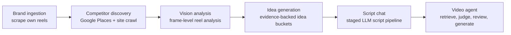
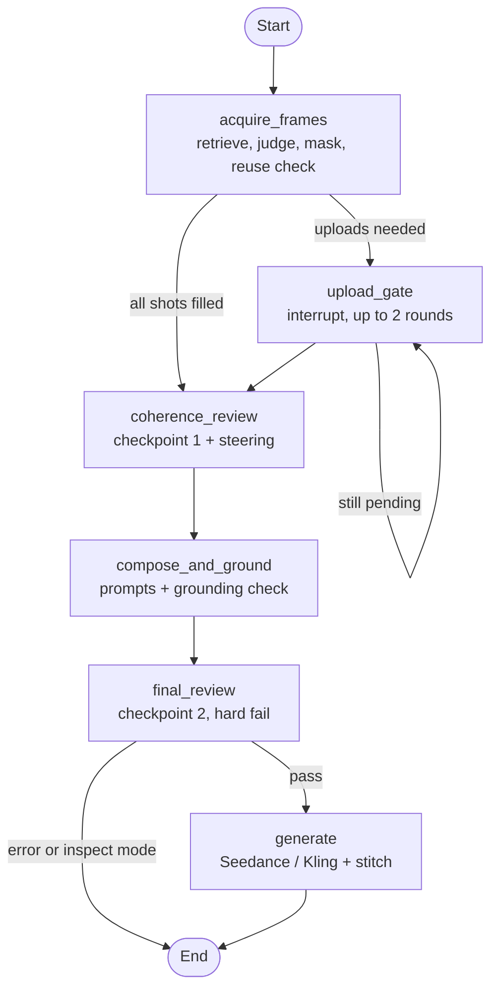

# HeatMap: Portfolio Case Study Packet

Hand this whole file to the portfolio agent, together with the image folder `public/projects/heatmap/` that sits next to it. Everything below is grounded in the HeatMap repo, the agentProto2 audit run `2026-07-05T05-21-43Z_39c5d015`, and the HeatMap bullets on Yeshwanth's resume.

---

## PART A. Instructions for the portfolio agent

### A1. What this page is

There is no live demo and no screen recording of the product. The page is a **case study that walks a reader through one real run of the video agent**, step by step, using the actual artifacts the agent saved: the frames it retrieved, the ones it rejected and why, what it blurred, where it asked a human for help, how it reviewed its own picks, how it corrected one, and the prompt that went to the video model. The page ends with the finished video.

Audience is recruiters (skim, 30 seconds) and hiring managers / engineers (read, 3 to 5 minutes). Design for both: the top of the page must make sense on its own, and the depth must be opt-in.

### A2. Non-negotiables

1. **Progressive disclosure.** Never show everything at once. The agent walkthrough (Section 4) is a vertical stepper: one step visible in focus at a time (scroll-driven or click-through), each step = one visual + two or three short lines + one "what the agent decided" callout. Raw JSON and full prompts live in collapsed `<details>` blocks.
2. **Use the real images and the real numbers below.** Do not invent metrics, users, or results. Do not round or restyle similarity scores (show 3 decimals as given).
3. **Keep the honesty labels exactly as specified** (Section 4 steps 8 and 9, Section 8). They are part of the story, not fine print.
4. Dark-minimal style to match the rest of the site. Images get rounded corners, captions underneath in muted text, `loading="lazy"`, and meaningful `alt` text.
5. Candidate grids: render as a row of 6 tiles (2 x 3 on mobile). Each tile shows its similarity score as a small badge. The chosen tile gets an accent outline and a "LOCKED" badge; rejected tiles are dimmed to about 45% opacity. Build these grids in HTML/CSS from the individual image files, do not bake text into images.
6. No colons or em-dashes in the visible page copy I have written below; keep that voice if you tighten the copy.
7. No link to the GitHub repo (it is private). Use the line "Code available on request" instead.

### A3. Page outline (in order)

| # | Section | Purpose | Est. length |
|---|---|---|---|
| 1 | Hero | Title, tagline, role/timeline chips, 3 stat chips, final video | 1 screen |
| 2 | The problem | Why this exists | 3 sentences |
| 3 | The platform | Whole HeatMap pipeline, one diagram | diagram + 5 one-liners |
| 4 | Inside the video agent | The 9-step walkthrough of one real run | the core of the page |
| 5 | How it is wired | LangGraph diagram + component table | diagram + table |
| 6 | Engineering decisions | 5 to 6 short cards | cards |
| 7 | Production system | Infra that served users | short list + chips |
| 8 | Status and what is next | Honest scope | 4 bullets |
| 9 | Stack | Chips | 1 row |

Homepage grid: **yes, show HeatMap on the homepage grid** (see Part C).

---

## PART B. Page content

### 1. Hero

- **Title**: HeatMap
- **Tagline**: An agentic AI marketing copilot that studies what works in local competitors' Instagram Reels and turns it into shot-by-shot video for small businesses.
- **Chips**: Co-Founder and Forward Deployed Engineer · Dec 2025 to 2026 · Full stack, AI, infra
- **Stat chips** (from resume): `40 users` · `~50 hours saved per business` · `5-shot reel, 15 seconds`
- **Media**: `final-video.mp4` (vertical 9:16, muted autoplay loop, with a play/unmute control). Until the file exists, use `hero.jpg` as the poster.
- **Status line under hero**: Served 40 users from Dec 2025 to Mar 2026, now offline. The v2 video agent shown below is a prototype, run in inspect mode.

### 2. The problem

Local restaurants and shops know Reels drive foot traffic but have no video team and no time to study what their competitors post. Generic AI video tools produce content that looks nothing like the brand or the neighborhood. HeatMap grounds every idea and every shot in evidence from real, local, high-performing reels.

### 3. The platform (diagram)

Render this as a clean horizontal flow (Mermaid is fine):



One-liners under the diagram:

- **Brand ingestion.** Scrapes the brand's own reels (Apify), analyzes frames with a vision model (Qwen3-VL-Flash), and writes a Brand DNA profile (GPT-4o).
- **Competitor discovery.** Finds real nearby competitors with Google Places, extracts their Instagram handles with headless Chrome, and profiles them.
- **Vision analysis.** Pulls competitor reels and analyzes the top ones frame by frame.
- **Idea generation.** Produces three buckets of ideas, each tied to the competitor evidence that supports it.
- **Script chat.** The user refines an idea in chat, and a staged pipeline (spec, patterns, draft, validate, repair with up to 3 retries) outputs a shot-by-shot script.
- **Video agent.** Turns that script into a video. This is the part the rest of the page opens up.

### 4. Inside the video agent (the walkthrough)

Intro line: Below is one real run of the agent for a Pittsburgh Thai quick-service restaurant, Grapow Thai. Every image is an artifact the agent saved during the run.

Build as a stepper with these 9 steps. Step header format: small step number, a title, and a one-line subtitle.

---

**Step 1. The input: a 5-shot script**

Visual: a compact table of the 5 shots (render from this data, no image).

| Time | Beat | What the shot needs |
|---|---|---|
| 0-3s | Hook | Extreme close-up, noodles lifted out of a steaming curry bowl |
| 3-6s | Context | Wide interior, digital ordering screens, counter with to-go packaging |
| 6-9s | Product | Overhead, boat noodles and crispy tonkatsu, lime and chili |
| 9-12s | Social proof | Team member plating a bowl behind the counter, one spoken line |
| 12-15s | CTA | Hands picking up a branded to-go bag, signage behind |

Copy: The script comes from the chat step. Each shot carries a content type (food hero, environment, person action), camera notes, and two or three visual anchor phrases the agent can search with.

`<details>` "Brand DNA used for this run": Grapow Thai is a quick-service restaurant that specializes in Asian street food, particularly Thai cuisine. Audience is young adults and students aged 18 to 35 looking for quick, casual dining or a place to study.

---

**Step 2. Retrieval: search real footage, not stock**

Visual: 6-tile candidate grid for shot 1 (Hook), in this order:

| File | Score | State |
|---|---|---|
| `retrieval-shot1-cand1-score0.302.jpg` | 0.302 | rejected |
| `retrieval-shot1-cand3-score0.297.jpg` | 0.297 | rejected |
| `retrieval-shot1-cand5-score0.296.jpg` | 0.296 | rejected |
| `retrieval-shot1-cand0-score0.271.jpg` | 0.271 | rejected |
| `retrieval-shot1-cand2-score0.254.jpg` | 0.254 | rejected |
| `retrieval-shot1-cand4-score0.252.jpg` | 0.252 | **LOCKED** |

Copy: Every frame of every scraped local reel is embedded with CLIP (ViT-L/14) and stored in Pinecone. For each shot the agent searches with each anchor phrase ("steaming curry bowl", "Thai noodle soup bowl", "rice noodles in broth"), merges the hits with reciprocal rank fusion, drops anything under a similarity gate, and keeps the top 6.

Show the three anchor phrases as small pills above the grid.

---

**Step 3. The vision judge: similarity is not relevance**

Visual: same grid, now with the two highest-scoring tiles (0.302 and 0.297) highlighted in a warning color, and the locked tile (0.252) in the accent color.

Copy: The two highest-scoring frames are photos of an ordering kiosk that happens to display a picture of a curry bowl. Embedding search loved them. A GPT-4o vision judge looks at the actual images against the shot description, and it is never shown the similarity scores, so it cannot be anchored by them. It picked the lowest-scoring candidate, the only one that is really a noodle pull.

Callout ("What the agent decided"), quote verbatim:
> "This image closely matches the description with rice noodles being lifted, visible broth, and herbs, fitting the food hero context." Verdict good_fit.

---

**Step 4. Privacy masking**

Visual: three images side by side, `mask-before.jpg` | `mask-map.jpg` | `mask-after.jpg`, captioned "Locked frame", "Detected face region", "What moves forward".

Copy: Locked frames come from other people's footage, so before anything is reused the agent runs face detection (a SAM based masker with an OpenCV Haar backstop) and blurs what it finds. Here it found one face region covering about 1.1% of the frame.

---

**Step 5. When retrieval fails, ask a human**

Visual: 6-tile grid for shot 4 (Social proof), all tiles dimmed, a single "NO MATCH" badge across the row:
`nomatch-shot4-cand0-score0.271.jpg`, `nomatch-shot4-cand1-score0.263.jpg`, `nomatch-shot4-cand2-score0.264.jpg`, `nomatch-shot4-cand3-score0.229.jpg`, `nomatch-shot4-cand4-score0.258.jpg`, `nomatch-shot4-cand5-score0.271.jpg`

Copy: Shot 4 needs a team member plating food. Retrieval returned six confident-looking matches, all of them menu screens. The judge rejected every one. The agent then checked whether a frame it had already locked for another shot could be reused, decided none fit a person-action shot, and paused the graph to request a photo upload from the business. It waits for up to two upload rounds, then continues with a partial set instead of failing the whole video.

Callout, verbatim from the judge:
> "None of the candidate images depict a person at a restaurant counter, staff plating a food bowl, or a team member behind the counter." Verdict no_relevant_frames.

Small note under callout: This pause is a LangGraph `interrupt()`, so the run resumes exactly where it stopped once the upload arrives.

---

**Step 6. Checkpoint 1: the agent reviews its own picks**

Visual: 4 locked frames in a row, each with a score badge out of 10 and a pass/fail dot.

| File | Shot | Score | Pass bar | Result | Issue the reviewer wrote |
|---|---|---|---|---|---|
| `locked-shot1.jpg` | Hook | 8 | 8 | pass | Fork used instead of chopsticks |
| `locked-shot2.jpg` | Context | 7 | 6 | pass | Missing digital ordering screens and fresh ingredients |
| `locked-shot3-before-steer.jpg` | Product | 6 | 8 | **fail** | Missing tonkatsu and lime wedge |
| `locked-shot5-flagged.jpg` | CTA | 5 | 6 | **fail, wrong category** | No to-go bag or Grapow signage visible |

Copy: Each frame passed the judge on its own. Checkpoint 1 is a second vision pass that looks at the whole set against the script together. The pass bar moves with the content type, stricter for food (8) and looser for environments (6), because a slightly wrong room is fine but a slightly wrong dish is not.

---

**Step 7. Steering: fix the failed shot**

Visual: before/after pair, `locked-shot3-before-steer.jpg` (label "Attempt 1, score 6") and `locked-shot3.jpg` (label "Attempt 2, locked"). Under it, a small 4-tile strip of the attempt 2 candidates: `steer-shot3-cand0-score0.279.jpg` (LOCKED), `steer-shot3-cand1-score0.274.jpg`, `steer-shot3-cand2-score0.256.jpg`, `steer-shot3-cand3-score0.247.jpg`.

Copy: For a failed shot the agent does not just retry. It rewrites the search phrases to target exactly what the reviewer said was missing, excludes frames it has already tried, re-retrieves, and re-judges. Every attempt is kept in a ledger so it can fall back to the best one. Each shot gets at most 3 attempts.

`<details>` "The rewritten search phrases" (verbatim):
- Overhead view of boat noodles with glossy broth and a crispy tonkatsu cutlet on a plate, lime wedge and chili flakes being sprinkled
- Top-down shot of Thai boat noodles next to a golden-brown tonkatsu with lime and chili flakes
- Brightly lit overhead image of a bowl of noodles with broth and a plate of crispy tonkatsu, lime wedge and chili flakes visible

Callout, verbatim from the attempt 2 judge:
> "Candidate 0 shows an overhead view of a dish with elements like a crispy cutlet, lime wedge, and glossy broth, which aligns well with the product showcase description."

---

**Step 8. The locked reference set and the prompt**

Visual: a filmstrip of 5 reference tiles labeled Image1 to Image5:
`locked-shot1.jpg`, `locked-shot2.jpg`, `locked-shot3.jpg`, `locked-shot2.jpg` (label "Image4, environment only"), `locked-shot5-flagged.jpg` (label "Image5, lighting only").

Copy: The locked frames become visual references for the video model. A prompt composer turns the script, the Brand DNA, and each frame's description into one generation prompt, and it follows one rule above all. When a frame disagrees with the script, the script wins, and the frame is used only for setting and lighting.

Honesty label (keep, styled as a small note): In this run the pipeline stopped after the steering step, before the composer ran. The prompt below was written from the run's locked frames and descriptions using the composer's own rules.

`<details>` "Full prompt sent to the video model" — paste the prompt from Part E verbatim, in a monospace block.

---

**Step 9. The output**

Visual: `final-video.mp4`, vertical, centered, with native controls.

Copy: The locked references and the prompt were handed to Seedance to generate the final 15-second reel.

Honesty label: In the v2 prototype the generation and stitching steps are stubs, so this clip was generated manually from the agent's outputs. In the production version (v1) the same handoff ran automatically through the TopView API with ffmpeg stitching.

---

### 5. How it is wired

Diagram (Mermaid):



Component table:

| Layer | What it is | Code |
|---|---|---|
| Orchestrator | A vision-capable GPT-4o agent that makes the judgment calls (triage, reuse, steer, backtrack) but delegates the heavy lifting | `orchestrator.py` |
| Deterministic flows | Retrieval and judging, masking, composition, generation | `flows.py` |
| Atomic tools | 15 single-purpose tools, e.g. retrieval planner, judge, reusability check, face masker, coherence reviewer, batch planner | `tools/` |
| State | One typed state object with a per-shot attempt ledger | `models.py` |
| Graph | LangGraph state machine with human-in-the-loop interrupt | `graph.py` |
| Observability | Every retrieval, frame, LLM request and response saved per run, plus a live Streamlit activity feed | `audit.py`, `app.py` |

Note for the agent: this is intentionally not an open-ended ReAct loop. The architecture doc states the orchestrator is bounded and works over deterministic flows. Present it that way.

### 6. Engineering decisions (cards)

1. **Scores never reach the judge.** The vision judge sees images and the shot spec only, so embedding similarity cannot bias it. Step 3 shows why.
2. **Two vision checkpoints.** Per-frame judging catches wrong images, a whole-set review catches wrong combinations, and a final replication review can hard-fail the run before any money is spent on generation.
3. **Bounded autonomy.** At most 3 attempts per shot, 2 upload rounds, and 10 orchestrator iterations, so cost and latency have a ceiling.
4. **Degrade, do not crash.** Missing shots after the upload budget produce a partial video instead of an error.
5. **Script beats reference.** A conflict rule in the prompt composer keeps retrieved footage from overriding what the script asked for.
6. **Everything is auditable.** Each run writes a numbered folder of every decision, which is what made this case study possible after the servers were shut down.

### 7. Production system (v1)

Copy: The first version ran as a product for 40 users between December 2025 and March 2026.

- React + TypeScript frontend served by nginx, FastAPI backend
- Redis with RQ workers on three priority queues for scraping, analysis, and generation jobs
- Supabase (Postgres and auth), S3 for brand artifacts
- Kubernetes on AWS (kOps), Helm releases, ALB ingress, images in ECR
- Pinecone frame index, TopView API for video generation, ffmpeg for stitching
- Stripe billing with free, pro, and pro-plus-video tiers and per-plan AI token budgets

### 8. Status and what is next

- Production v1 is offline to save cost. The repo, the audit trails, and the frame index artifacts are preserved.
- The v2 agent on this page is a prototype run in inspect mode. Its generation and stitching steps are stubs by design while the orchestration was being tested.
- This run stopped after the steering step on a type-validation bug in how excluded frame IDs were recorded. Shot 5 was flagged but not yet steered.
- Next steps are wiring the generation tools to the real video APIs, fixing that validation bug, and adding a real upload for shots like shot 4.

### 9. Stack chips

Python · FastAPI · LangGraph · OpenAI GPT-4o · CLIP · Pinecone · Qwen3-VL · OpenCV · Seedance · React · TypeScript · Redis / RQ · Supabase · S3 · Docker · Kubernetes · Helm · AWS

---

## PART C. Card metadata (homepage grid)

- **slug**: `heatmap`
- **thumbnail**: `public/projects/heatmap/thumbnail.jpg` (swap for a poster frame of `final-video.mp4` once it exists)
- **card line**: An agent that turns local competitors' best Reels into a shot-by-shot video for small businesses.
- **tags**: Agentic AI · Multimodal · Retrieval · Full stack
- **placement**: homepage grid, first row

## PART D. Resume alignment (use these, they match the resume)

Show under a small "Role" block, or on the Experience page entry for HeatMap, linking to this case study.

**Forward Deployed Engineer / Co-Founder, HeatMap** · December 2025 to March 2026

- Led development of an agentic multimodal AI system using vision models and LLM reasoning to analyze competitor media and generate evidence-backed marketing videos (Seedance), reducing effort by 50 hours per business.
- Engineered a cloud-native AI pipeline on Kubernetes using FastAPI, Redis workers, Postgres, and S3 to orchestrate brand ingestion, competitor discovery, video analysis, and iterative idea and video generation for 40 users.

(These are taken from the recommendation-systems resume variant, which matches the codebase. See the notes to Yeshwanth in Part F before publishing.)

## PART E. The prompt (paste verbatim into Step 8's details block)

```
A connected 15-second vertical Reel for Grapow Thai, five shots cut together into one continuous sequence with a fast, energetic quick-service pace.

0–3s, HOOK: Use @Image1 as reference for bowl styling, steam, and warm overhead lighting, but replace the fork shown in it with chopsticks. Extreme close-up, static macro, shallow depth of field, on a steaming red curry broth bowl. Chopsticks lift a tangle of glistening rice noodles straight up out of the broth, steam curling into frame as strands stretch and separate. On-screen text, bold white sans-serif with a subtle drop shadow: "This is what lunch should taste like." Match cut into the next shot.

3–6s, CONTEXT: Use @Image2 as reference for the interior's color palette, mural, and warm pendant lighting. Wide interior shot, camera slowly pushing in from the entrance on stabilized handheld. A glowing digital ordering screen sits near the counter, fresh ingredients and to-go packaging lined along its edge, the same saturated blue, yellow, and pink mural in the background. Warm pendant light mixes with cool screen glow. Crossfade into the next shot.

6–9s, PRODUCT SHOWCASE: Use @Image3 as the direct reference for the dish, plating, and lighting. Static top-down overhead shot, bright even lighting, on this plated bowl of boat noodles and crispy tonkatsu. Glossy amber-orange curry broth pools around golden crispy-fried cutlet and a nest of crunchy noodles, lime wedge and herbs at the edge. A hand enters frame to sprinkle chili flakes and squeeze lime over the top. On-screen text: "Curry bowls. Noodles. Tonkatsu." Hard cut into the next shot.

9–12s, SOCIAL PROOF: Use @Image4 as environment and lighting reference only, the same counter setting with digital menu screens glowing behind. A team member stands behind the counter plating a fresh curry bowl, glancing up with a confident smile as steam rises off the dish, soft fill light from the screens behind them. They say: "Everything's made fresh, grab a bowl and you're good to go." A slightly slower beat than the shots before it. Hard cut into the final shot.

12–15s, CTA: Use @Image5 only for its warm ambient lighting tone, not its content. Close-up, static shot, rack focus pulling from a branded to-go bag in the foreground to soft-focused storefront signage and neon accents behind it. A pair of hands lifts the paper to-go bag off the counter, branding briefly legible before the background resolves out of focus. On-screen text: "Study spot + street food fix." Snappy, quick close to end the sequence.

Overall grade: vibrant, saturated color, punchy reds and greens on the food shots, cleaner modern tones on the interior shots. Brand tone throughout: a modern quick-service Thai street food spot built for a young, casual, student crowd.
```

## PART F. Notes to Yeshwanth (not for the page)

1. **Add the video.** Drop the generated clip in as `public/projects/heatmap/final-video.mp4` (H.264, under ~8 MB for web), then export a poster frame to replace `hero.jpg` and `thumbnail.jpg`.
2. **Resume mismatch on the MLE variant.** Its second HeatMap bullet says AWS EKS with infrastructure provisioned in Terraform. The repo runs self-managed Kubernetes via kOps, and Terraform only creates the kOps state bucket. The recommendation variant's wording is accurate; consider copying it into the MLE resume so the portfolio and every resume tell the same story.
3. **"ReAct" on both resumes.** The agentProto2 architecture doc says the orchestrator is deliberately "not unbounded ReAct". If an interviewer reads this page and asks, be ready to explain that, or change the resume wording to "LLM orchestration" to match.
4. **Dates.** The resume lists HeatMap through March 2026, but this v2 run is from July 2026. The page says "Dec 2025 to 2026". Decide whether to extend the resume end date or describe v2 as continued work after launch.
5. **Third-party footage.** Every retrieved frame comes from other creators' public reels, some with their caption text burned in and some with people visible (the seated diner in shot 2, the person at the kiosk in shot 5, hands in several). The pipeline only blurred faces in shot 1. Consider blurring the people in those portfolio copies, or add a caption like "Frames sourced from public local reels, shown for illustration."
6. **Rotate your OpenAI key.** It was printed into this chat when I read the agentProto2 `.env`. Revoke it in the OpenAI dashboard and issue a new one.
7. The packet folder lives inside the HeatMap repo. It is untracked, so either move it into the portfolio repo or add `portfolio_packet/` to `.gitignore`.
